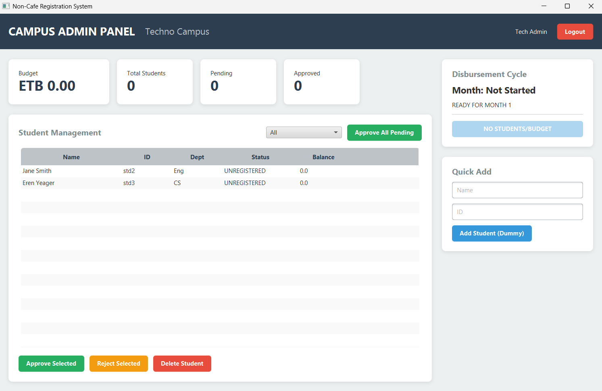
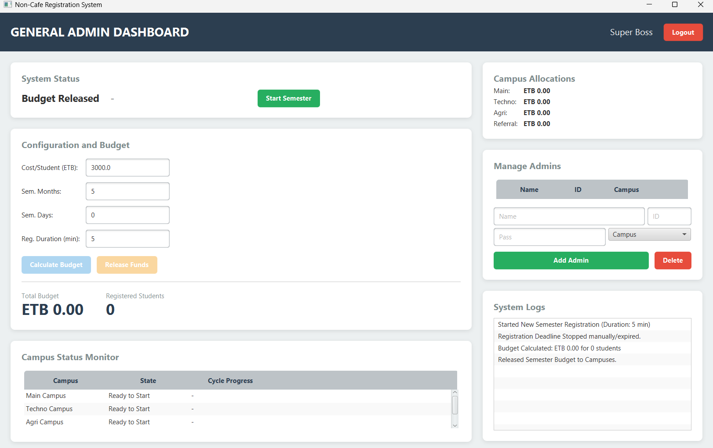

# 🎓 Non-Cafe Registration System


> **A comprehensive JavaFX solution for managing university non-cafe cost-sharing registration, budget distribution, and campus administration.**

---

## 📖 Table of Contents
- [Overview](#-overview)
- [Key Features](#-key-features)
- [System Architecture](#-system-architecture)
- [Tech Stack](#-tech-stack)
- [Getting Started](#-getting-started)
- [Development Workflow](#-development-workflow)
- [Project Structure](#-project-structure)
- [Team & Roles](#-team--roles)
- [Screenshots](#-screenshots)

---

## 🔎 Overview

The **Non-Cafe Registration System** is a collaborative desktop application designed to streamline the administrative process of student cost-sharing. In many universities, students who do not utilize campus cafeteria services ("Non-Cafe") are entitled to a monthly budget allowance.

This system automates:
1. **Student Registration:** Students apply for non-cafe status digitally.
2. **Administrative Approval:** Campus admins verify and approve requests.
3. **Budget Management:** A General Admin calculates and distributes government allocated budgets across multiple campuses (Main, Techno, Agri, Referral).

---

## 🌟 Key Features

### 👨‍🎓 For Students
* **Dashboard:** View personal profile, bank account details, and registration status.
* **One-Click Registration:** Apply for non-cafe status with a single click.
* **Live Status Tracking:** Real-time updates on application status (Pending → Approved/Rejected).
* **Transaction History:** Log of all budget disbursements and balance updates.

### 🏫 For Campus Admins
* **Campus Filtering:** View only students belonging to their specific campus.
* **Batch Operations:** Approve or reject registrations efficiently.
* **Data Management:** Edit or delete student records.
* **Statistics:** Real-time counters for Registered vs. Pending students.

### ⚙️ For General Admin (Super User)
* **Global Control:** Set registration deadlines and semester durations.
* **Budget Calculator:** Auto-calculate budget per campus based on active student counts.
* **System Timer:** Automated countdown clock for registration windows.
* **Audit Logs:** System-wide transaction history monitoring.

---

## 🏗 System Architecture

The project follows the **MVC (Model-View-Controller)** design pattern with a custom Singleton DataStore for persistence.

* **Model:** Plain Java Objects (POJOs) representing `Student`, `Admin`, and `SystemState`.
* **View:** FXML files styled with CSS for a modern, responsive UI.
* **Controller:** Java classes handling business logic and UI events.
* **Data Layer:** `DataStore.java` uses Java Serialization to save the entire system state to local `.dat` files, ensuring data persists between restarts.

---

## 💻 Tech Stack

* **Language:** Java 25 (Open JDK)
* **GUI Framework:** JavaFX 19
* **Build Tool:** Maven
* **Version Control:** Git & GitHub
* **IDE:** IntelliJ IDEA / VS Code

---

## 🚀 Getting Started

Follow these steps to set up the project locally.

### Prerequisites
1. **Java JDK 25** or higher installed.
2. **JavaFX SDK** (downloaded and extracted).
3. **Git** installed on your machine.

### Installation

1. **Clone the Repository**
    ```bash
    git clone https://github.com/ZedoMak/non-cafe-registration.git
    cd non-cafe-registration
    ```

2. **Configure in IDE (IntelliJ Example)**
    * Open the project folder.
    * Go to `File > Project Structure > Libraries`.
    * Add the `lib` folder of your **JavaFX SDK**.

3. **Run the Application**
    * Locate `src/main/java/com/noncafe/Main.java`.
    * Right-click and select **Run 'Main'**.
    * *Note: You may need to add VM Options if JavaFX is not in the path:*
        ```bash
        --module-path /path/to/javafx-sdk/lib --add-modules javafx.controls,javafx.fxml
        ```

### Default Login Credentials (Dummy Data)
* **General Admin:** `UserID: genadmin` | `Password: admin123`
* **Campus Admin:** `UserID: admin1` or `admin2` (and so on for all admins) | `Password: 123`
* **Student:** `UserID: std1` | `Password: 123`

---

## 🤝 Development Workflow

We use a strict **Git Flow** strategy to prevent conflicts.

### Branching Strategy
* `main`: Production-ready code. **DO NOT PUSH HERE DIRECTLY.**
* `develop`: The integration branch. All features merge here first.
* `feature/*`: Individual branches for specific tasks (e.g., `feature/login-ui`, `feature/budget-logic`).

### How to Contribute
1. **Pull Latest Code:**
    ```bash
    git checkout develop
    git pull origin develop
    ```

2. **Create a Branch:**
    ```bash
    git checkout -b feature/your-feature-name
    ```

3. **Commit Changes:**
    ```bash
    git add .
    git commit -m "feat: Added new dashboard button"
    ```

4. **Push & Create PR:**
    ```bash
    git push origin feature/your-feature-name
    ```
    *Go to GitHub and open a Pull Request to `develop`.*

---

## 📂 Project Structure

```text
src/main
├── java/com/noncafe
│   ├── Main.java             # Entry point
│   ├── controller/           # UI Logic (Login, Admin, Student)
│   ├── data/                 # DataStore (Singleton & File I/O)
│   ├── model/                # Data Classes (User, Student, Enums)
│   └── util/                 # Helpers (SceneSwitcher, SessionManager)
└── resources/com/noncafe/views
    ├── css/                  # Stylesheets
    └── *.fxml                # Layout files

## 👥 Team & Roles

| Role | Responsibility | Status |
|------|----------------|--------|
| Architect | Model Design & System State | ✅ Active |
| Vault Keeper | Data Persistence & Serialization | ✅ Active |
| Gatekeeper | Authentication & Session Management | ✅ Active |
| Student Rep | Student Dashboard Logic | ✅ Active |
| Campus Chief | Admin Dashboard & Tables | ✅ Active |
| Sys Admin | General Admin & System Logic | ✅ Active |

## 📸 Mission Intel (Screenshots)

| Login Screen | Student Dashboard |
| :---: | :---: |


| Admin Dashboard | General Admin Panel |
| :---: | :---: |

 |

